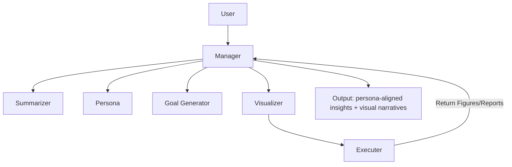

# Package Diagram of mindscope:



---

## ⚙️ Responsibilities per Module

### 1. **Manager (`manager.py`)**

* Public API (`MindscopeManager`)
* Orchestrates flow between components
* Provides methods like:

  ```python
  ms = MindscopeManager(persona="CXO")
  ms.analyze(df)
  ```

### 2. **Summarizer (`summarizer.py`)**

* Analyzes dataset (data types, stats, patterns, samples)
* Generates structured metadata (`SummaryResult`)
* Optional LLM enrichment

### 3. **Persona (`persona.py`)**

* Defines *viewpoint* for analysis
* Could load from:

  * Predefined profiles (e.g., "CXO", "Customer", "Data Scientist")
  * User-defined JSON/YAML

### 4. **Goal Generator (`goal_generator.py`)**

* Uses summary + persona to ask questions like:

  * "What impacts revenue most?"
  * "Which features vary most by region?"
* Returns structured **goal-driven insights**

### 5. **Visualizer (`visualizer.py`)**

* Generates visualization code (matplotlib, seaborn, plotly, etc.)
* Can be prompt-driven (“show me trends by category”)

### 6. **Executer (`executer.py`)**

* Runs visualization code safely
* Auto-error-correction loop if code fails
* Returns plot objects (e.g., `matplotlib.Figure`) or images

---

## 📊 Example Package Interaction (Persona-based Analysis)

```python
from mindscope import MindscopeManager
import polars as pl

df = pl.read_csv("sales.csv")

ms = MindscopeManager(persona="CXO")
result = ms.analyze(df)

# result = {
#   "summary": {...},
#   "persona_goals": {...},
#   "visualizations": [fig1, fig2],
#   "narrative": "Revenue growth is driven by..."
# }
```
