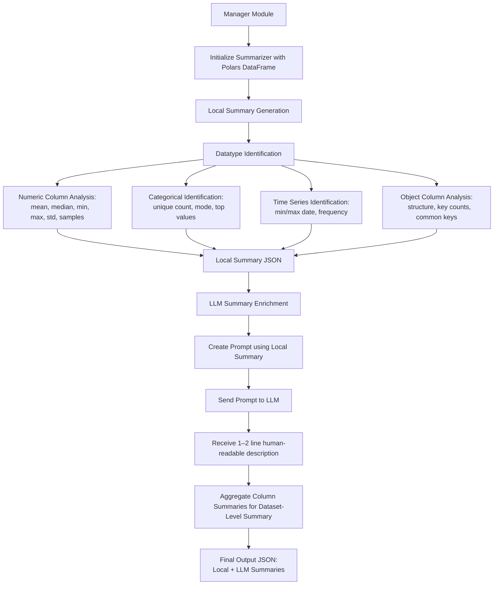

# **📊 Summarizer**

The **Summarizer** component is responsible for generating descriptive metadata for a given dataset.
It works in two stages:

1. **🧮 Local Summary Generation** – Uses statistical and structural analysis to produce column-level and dataset-level summaries without using generative models.
2. **🧠 LLM Summary Enrichment** – Enhances the locally generated summary using a Large Language Model (LLM) to produce a concise, human-readable 1–2 liner description.

---

## **🗂 Overview**

-   **📥 Input**: Dataset in the form of a Polars DataFrame.

-   **📤 Output**:

    -   Local summary in JSON format (currently; will migrate to Pydantic models in the future).
    -   Enhanced summary using an LLM.

-   **⚙ Process**:

    1. 🔍 Analyze each column to determine its type and compute relevant metrics.
    2. 📈 Generate dataset-level statistics and metadata.
    3. 🤖 Feed local summary into LLM with a predefined prompt to produce an enriched natural language description.

---

## **🚀 Initialization**

-   **📦 Input Source**: Receives data from the **Manager** module.
-   **🔧 Initialization**: The Manager instantiates a `Summarizer` object and passes the DataFrame.
-   **📊 Scope**: Works at **column-level** first, then aggregates to produce dataset-level insights.

---

## **📍 Local Summary**

The local summary process is purely statistical/structural, without AI-generated text.
It includes:

### 1. **🔎 Datatype Identification**

For each column:

-   Use Polars' schema inspection (`df.schema`) to determine the declared datatype.
-   Map to high-level categories:

    -   **🔢 Numeric** (integer, float)
    -   **🏷 Categorical** (string with low unique count)
    -   **📅 Datetime** (date/time types)
    -   **📦 Object** (complex structures: lists, dictionaries, JSON strings)

---

### 2. **📐 Numeric Columns Analysis**

For numeric columns, compute:

| 📊 Metric          | Formula                                                       | Description                        |
| ------------------ | ------------------------------------------------------------- | ---------------------------------- |
| Mean               | \$\bar{x} = \frac{\sum\_{i=1}^n x_i}{n}\$                     | Average value                      |
| Median             | Middle value after sorting                                    | Robust measure of central tendency |
| Minimum            | \$\min(x)\$                                                   | Lowest value                       |
| Maximum            | \$\max(x)\$                                                   | Highest value                      |
| Standard Deviation | \$\sigma = \sqrt{\frac{\sum\_{i=1}^n (x_i - \bar{x})^2}{n}}\$ | Spread of values                   |
| Sample Values      | Random selection from column                                  | Gives a sense of actual values     |

**Example Output**:

```json
{
    "column_name": "age",
    "type": "numeric",
    "mean": 35.4,
    "median": 34,
    "min": 18,
    "max": 65,
    "std_dev": 8.9,
    "samples": [22, 45, 33]
}
```

---

### 3. **🏷 Categorical Identification**

-   **🧠 Heuristic**:
    A column is considered _categorical_ if:

    -   Datatype is string, **and**
    -   Unique values count ≤ 20% of total rows (threshold adjustable), **and**
    -   Values repeat frequently.

-   **📑 Metadata to capture**:

    -   Unique values count
    -   Top N most frequent categories with their counts and percentages
    -   Mode (most frequent category)

**Example Output**:

```json
{
    "column_name": "gender",
    "type": "categorical",
    "unique_count": 3,
    "top_values": [
        { "value": "Male", "count": 560, "percentage": 56.0 },
        { "value": "Female", "count": 430, "percentage": 43.0 },
        { "value": "Other", "count": 10, "percentage": 1.0 }
    ],
    "mode": "Male"
}
```

---

### 4. **⏳ Time Series Identification**

-   **🔍 Heuristic**:

    -   Datatype is date/datetime, **or**
    -   Values are strings that can be parsed into dates.

-   **📑 Metadata to capture**:

    -   Minimum date
    -   Maximum date
    -   Frequency detection:

        -   Compute differences between consecutive sorted dates.
        -   If differences are constant → fixed frequency (e.g., daily, monthly).
        -   Use mode of time deltas to infer periodicity.

**Example Output**:

```json
{
    "column_name": "order_date",
    "type": "datetime",
    "min_date": "2023-01-01",
    "max_date": "2023-12-31",
    "inferred_frequency": "daily"
}
```

---

### 5. **📦 Object Columns**

-   Capture metadata for stringified JSON, lists, or dictionaries.
-   Possible metrics:

    -   Structure type (list/dict)
    -   Avg. length or key count
    -   Common keys across rows (for dicts)

---

## **🧠 LLM Summary**

### **🎯 Purpose**

The LLM Summary converts raw statistical output into a concise, human-readable insight.

### **⚙ Process**:

1. 📝 Create a **prompt** combining:

    - Column name
    - Local summary JSON
    - Example phrasing instructions (e.g., _"Summarize in 1–2 lines focusing on meaning, trends, and anomalies"_)

2. 📤 Send prompt to LLM.
3. 📥 Receive and store natural language output.

**Example Prompt to LLM**:

```plaintext
Given the following metadata for a column, generate a 1–2 line human-readable summary:

Column: age
Type: numeric
Mean: 35.4
Median: 34
Min: 18
Max: 65
Std Dev: 8.9
Samples: [22, 45, 33]

Focus on describing what the values represent, typical ranges, and any noticeable spread.
```

**Example LLM Output**:

> "The 'age' column contains ages ranging from 18 to 65, with an average around 35 years, indicating a predominantly middle-aged population."

---

## **📊 Dataset-Level Summary**

After processing all columns:

-   Aggregate column summaries to create an overall dataset description.
-   LLM prompt includes:

    -   Purpose of dataset (if provided)
    -   Column-level summaries
    -   Data coverage (row/column counts, date range if time-based)

**Example**:

> "The dataset consists of 1,000 records capturing customer demographics, purchase history, and transaction dates. Most customers are aged 25–45, with purchases recorded daily throughout 2023."

---

## **📦 Final Output Structure**

```json
{
  "dataset_summary": {
    "row_count": 1000,
    "column_count": 12,
    "description": "Generated by LLM"
  },
  "columns": [
    {
      "name": "age",
      "local_summary": {...},
      "llm_summary": "..."
    },
    ...
  ]
}
```

---

## **📈 Diagram**



---

## **🏷 How Categorical Values are Identified in the Code**

`Todo move this to somewhere else.`

---

### 1. **📌 Explicitly Defined `pl.Categorical` Columns**

This is the most straightforward case.
Polars has a special data type called `pl.Categorical`. It's a highly optimized type for columns that contain a limited number of repeating string values (like "active", "inactive", "pending"). Polars stores these strings only once and uses efficient integers internally to represent them, saving memory and speeding up operations.

**💡 How the code handles it:**

The code directly checks if a column's data type is `pl.Categorical`:

```python
# From the function:
elif dtype == pl.Categorical:
    col_properties = {
        "identified_type": "categorical",
        "dtype": str(dtype),
        "categories": col.unique().sort().to_list(),
        # ... and other properties
    }
```

📍 In our example, the `status` column was created with `dtype=pl.Categorical`, so it's immediately identified correctly without any complex calculations.

---

### 2. **🧮 Inferred Categorical Columns (from Strings)**

This is the more interesting part.
A column might contain categorical data but be stored as a standard string (`pl.Utf8`).
For example, a `country` column with values like "India", "USA", "Germany" is conceptually categorical, but it might just be a string column in the raw data.

The function uses a set of **heuristics** 🤔 to decide if a string column should be treated as categorical.
The core idea is that **categorical columns have a low number of unique values relative to the total number of rows.**

The function uses a combination of two rules, and if **either one** is true ✅, the column is classified as categorical.

---

#### **🔍 Heuristic 1: The Uniqueness Ratio**

-   **📏 Formula:**
    \$Uniqueness\ Ratio = \frac{\text{Number of Unique Values}}{\text{Total Number of Rows}}\$

-   **💡 Logic:**
    If this ratio is very low, it means the values are repeated frequently, which is a strong sign of a categorical feature.

-   **⚙ In the code:**
    `(n_unique / n_rows) < categorical_threshold`

    -   The `categorical_threshold` defaults to **0.05** (or 5%).
    -   You can change this when calling the function.

**📌 Example:**
Imagine a DataFrame with **1,000 rows** representing employees.
A column named `department` has only **8 unique values** ("Sales", "HR", "Engineering", etc.):

-   `n_unique`: 8
-   `n_rows`: 1000
-   Ratio: \$8 / 1000 = 0.008\$

Since **0.008** < **0.05**, this column would be correctly identified as categorical.

---

#### **📉 Heuristic 2: The Absolute Unique Count Limit**

-   **📏 Formula:**
    \$\text{Number of Unique Values} < \text{Absolute Limit}\$

-   **💡 Logic:**
    If a column has fewer than a certain number of unique values (e.g., 50), it's very likely to be a set of categories, regardless of total rows.

-   **⚙ In the code:**
    `n_unique < categorical_unique_limit`

    -   The `categorical_unique_limit` defaults to **50**.

**📌 Example:**
`region_code` column:

-   `n_unique`: 3 (`'AS-E'`, `'EU-C'`, `'US-W'`)
-   `n_rows`: 7
-   Ratio: $ 3 / 7 \\approx 0.428\$

Here, ratio **0.428** is NOT less than **0.05** → Heuristic 1 fails ❌.
But Heuristic 2 passes ✅ because **3 < 50**.

---

### **🧾 Summary of the Logic Flow**

For any given string (`pl.Utf8`) column:

1. 🔢 **Count** the number of unique values (`n_unique`).
2. 📉 **Check Condition 1:** Is `(n_unique / n_rows) < threshold`?
3. 📏 **Check Condition 2:** Is `n_unique < absolute limit`?
4. ✅ If **Condition 1 OR Condition 2** is true → classify as **categorical**.
5. 📝 Otherwise → classify as a general **string** column.
